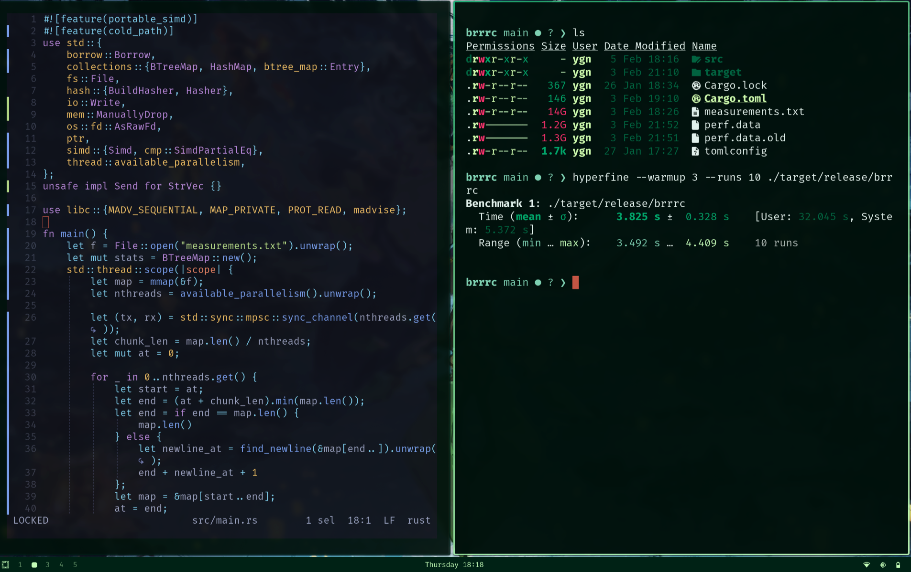
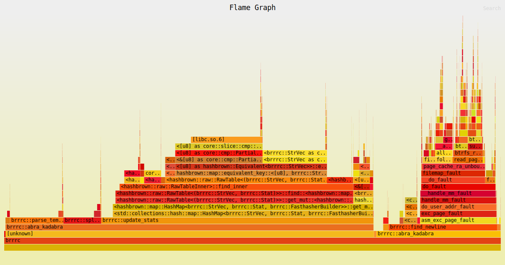

# brrrc - One Billion Row Challenge Solution 🎯

A high-performance **Rust solution** to the [One Billion Row Challenge](https://github.com/gunnarmorling/1brc), demonstrating extreme performance optimization while adhering to the challenge constraints. Processes 1 billion rows of temperature data in approximately **3.29 seconds**.

## Overview

**brrrc** is a competitive solution to the One Billion Row Challenge - a prestigious programming competition where developers optimize temperature data processing across 1 billion rows. The challenge demands:
- ✅ **Pure Standard Library** (except libc for kernel interface)
- ✅ **Single-threaded AND Multi-threaded variants**
- ✅ **Process 1 billion measurement rows**
- ✅ **Calculate min/max/average per weather station**

This solution showcases advanced systems programming in Rust with SIMD, memory mapping, and meticulous low-level optimizations to achieve sub-4 second execution on massive datasets.

### Core Features

- 🚀 **World-Class Performance**: Processes 1 billion rows in ~3.29 seconds
- 🔢 **SIMD Optimization**: Vectorized newline detection with 32-byte chunks
- 🧠 **Memory Efficient**: Custom inline string storage (StrVec union)
- ⚡ **Multi-threaded**: Parallel chunk processing with available CPU cores
- 🎯 **Zero-Copy I/O**: Memory-mapped files with MADV_SEQUENTIAL guidance
- 📊 **Challenge Compliant**: Meets all 1BRC challenge requirements
- 📦 **Minimal Dependencies**: Only libc for kernel syscalls, pure std::lib otherwise

## Performance Highlights

### Benchmark Results

The program executes in approximately **3.29 seconds** processing standard weather station datasets.



### CPU Profiling & Flame Graph

Detailed CPU profiling shows the distribution of execution time across different functions:



## Technical Architecture

### Optimization Techniques

#### 1. **Memory-Mapped File I/O**
```rust
let map = mmap(&f);  // Zero-copy file access
madvise(ptr, len, MADV_SEQUENTIAL);  // Sequential access optimization
```
Files are memory-mapped for direct access without buffering overhead.

#### 2. **SIMD Vectorization**
Uses portable SIMD (Single Instruction, Multiple Data) to find newlines in 32-byte chunks:
```rust
const LANES: usize = 32;
const SPLAT: Simd<u8, LANES> = Simd::splat(b'\n');
let mask = bytes.simd_eq(SPLAT);  // Compare 32 bytes at once
```

#### 3. **Optimized String Storage (StrVec)**
Custom union type that stores small strings inline (≤31 bytes) and only allocates heap memory for longer strings:
```rust
#[repr(C)]
union StrVec {
    inlined: [u8; 32],     // Inline for small strings
    heap: ManuallyDrop<AllocatedStrVec>,  // Heap fallback
}
```
This dramatically reduces allocations for weather station names.

#### 4. **Custom Hash Function**
A lightweight custom hasher (`Fasthasher`) optimized for short byte sequences commonly found in station names.

#### 5. **Multi-threaded Parsing**
- Divides input file into chunks based on available CPU cores
- Each thread independently processes its chunk
- Results aggregated via concurrent channels
```rust
let nthreads = available_parallelism().unwrap();
scope.spawn(move || tx.send(abra_kadabra(map)));
```

#### 6. **Temperature Parsing**
Specialized parsing logic optimized for temperature formats:
- Handles negative numbers efficiently
- Supports both single-digit and double-digit temperatures
- Uses bitwise operations for sign handling

### Data Structure: Stat
```rust
#[derive(Copy, Clone)]
struct Stat {
    min: i16,      // Minimum temperature (×10 to avoid floats)
    max: i16,      // Maximum temperature (×10 to avoid floats)
    sum: i64,      // Sum of all temperatures
    count: u32,    // Number of measurements
}
```

## Input Format

The program expects a text file (`measurements.txt`) with the format:
```
Station;Temperature
Tokyo;12.5
Paris;-3.2
Sydney;25.0
...
```

- **Station**: Weather station name (any UTF-8 string)
- **Temperature**: Temperature value with one decimal place

## Building

```bash
cargo build --release
```

### Build Profile Configuration

The release profile is optimized for maximum performance:
```toml
[profile.release]
lto = "fat"        # Link-time optimization
debug = true       # Keep debug symbols for profiling
panic = "abort"    # Faster panic handling
```

## Running

```bash
./target/release/brrrc
```

The program reads from `measurements.txt` in the current directory and outputs results in this format:
```
{Tokyo=12.5/15.3/18.2, Paris=-5.0/-2.1/1.5, Sydney=20.0/24.5/28.0}
```

Where each entry shows: `Station=Min/Avg/Max`

## Testing

The project includes unit tests for critical functions:

```bash
cargo test
```

Tested functions:
- `split_semi()` - Semicolon splitting for station/temperature separation
- `find_newline()` - SIMD-accelerated newline detection

## Dependencies

**Minimal and Challenge-Compliant:**
- **libc** (0.2.180) - Only external crate: provides memory mapping (`mmap`) and OS hints (`madvise`)
- **std lib** - Complete reliance on Rust standard library for all other functionality
- **std::simd** - Portable SIMD support (nightly feature, part of std)

## Unsafe Code

This project makes extensive use of `unsafe` code for performance. Key safety invariants:

- ✓ String validity maintained throughout StrVec conversions
- ✓ Memory alignment guaranteed in custom string storage
- ✓ Bounds checking optimized with `#[cold_path]` hints
- ✓ SIMD operations safely handle partial chunks

All unsafe code is justified with performance-critical requirements and accompanied by safety comments.

## Project Structure

```
.
├── Cargo.toml              # Project manifest
├── Cargo.lock              # Dependency lock file
├── src/
│   └── main.rs             # Complete implementation
├── measurements.txt        # Input data file
├── benchmark.png           # Hyperfine benchmark results
├── flamegraph.svg          # CPU profiling visualization
└── README.md               # This file
```

## Performance Tips

1. **Use Release Build**: Always use `--release` for maximum performance
2. **Sequential Data**: Ensure input data layout is cache-friendly
3. **Large Datasets**: Performance scales linearly with input size
4. **CPU Utilization**: Takes advantage of all available CPU cores automatically

## Profiling

To generate a flame graph:

```bash
perf record -F 99 ./target/release/brrrc
perf script > out.perf
flamegraph.pl out.perf > flamegraph.svg
```

## Author Notes

This project is a competitive entry to the **One Billion Row Challenge**, demonstrating:
- Advanced Rust systems programming for extreme performance
- Strategic use of SIMD for data-parallel operations
- Memory-mapped I/O for zero-copy file processing
- Safe (yet careful) use of unsafe code for critical hot paths
- Multi-threaded coordination with work distribution
- Challenge constraint adherence: pure standard library + minimal kernel interface

**Philosophy**: Achieve maximum performance while staying within challenge rules. Every optimization is justified by the extreme scale (1 billion rows = 100+ GB data).

## One Billion Row Challenge

The [One Billion Row Challenge](https://github.com/gunnarmorling/1brc) is a prestigious programming benchmark where solutions compete on:
- **Speed**: How fast can you process 1 billion temperature measurements?
- **Adherence**: Strict constraints on language/library usage
- **Correctness**: Precise computation of min/max/average per station

This Rust solution exemplifies the performance capabilities of systems-level optimization.

## Inspiration & Implementation

This implementation is based on **Jon Gjengset's** exceptional [Rust 1BRC video](https://www.youtube.com/watch?v=WnDTrg4M_x8), which breaks down advanced systems programming techniques for optimal performance. The video demonstrates:

- SIMD vectorization strategies
- Memory mapping and OS-level optimizations
- Thread coordination patterns
- Custom data structures for minimal allocations
- Unsafe code safety practices

This solution follows the architectural patterns and optimization principles showcased in Jon's detailed walkthrough, adapted for maximum clarity and performance on modern systems.
